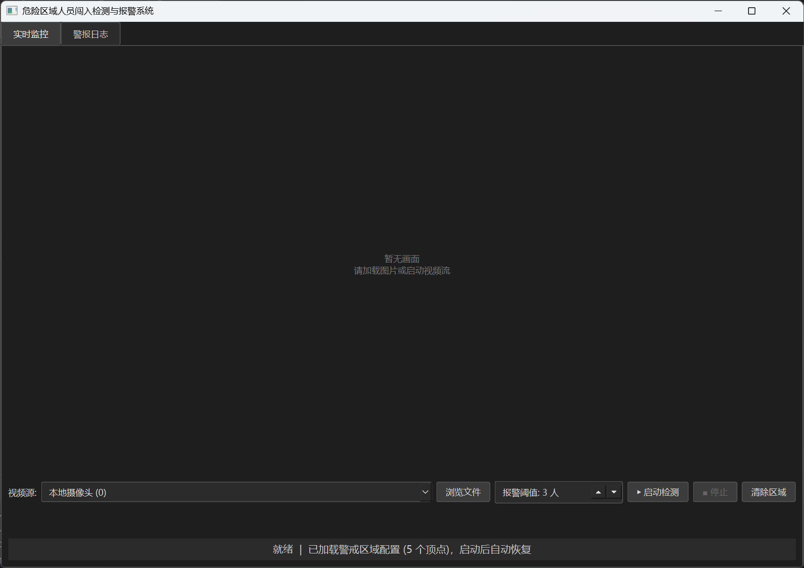
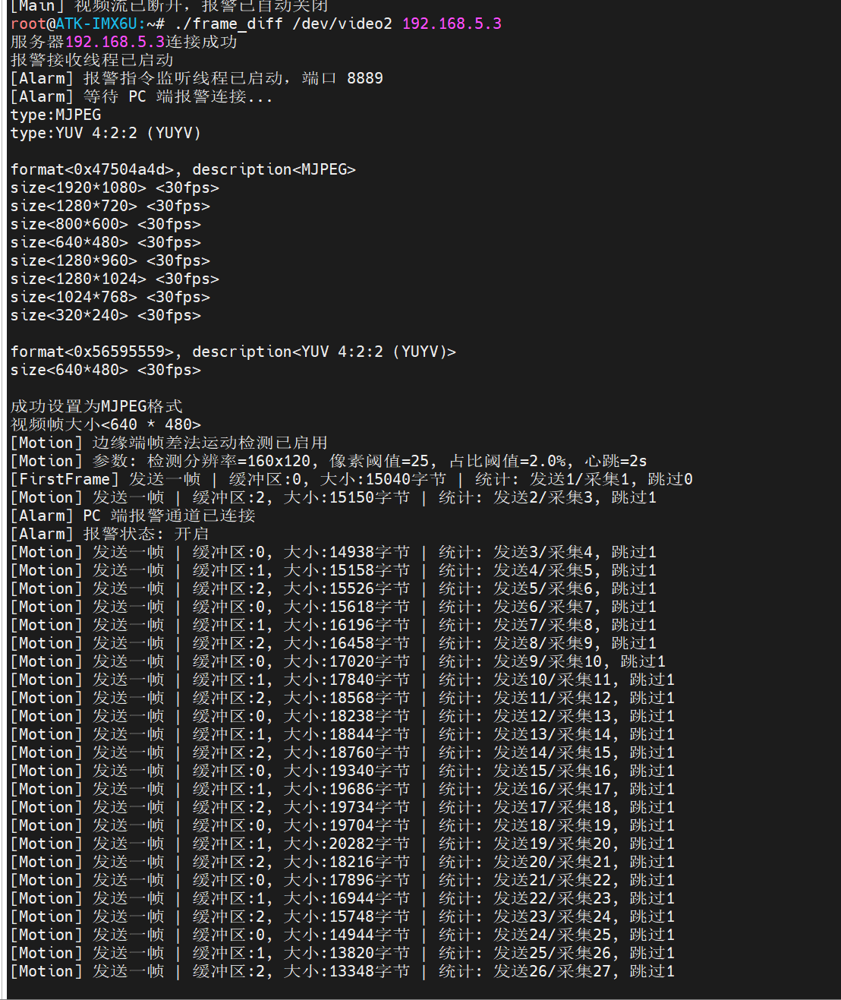
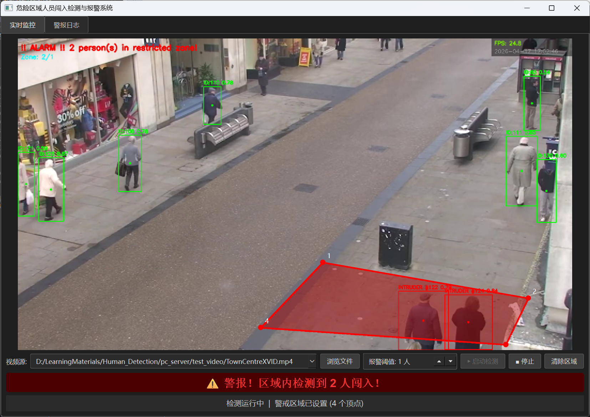
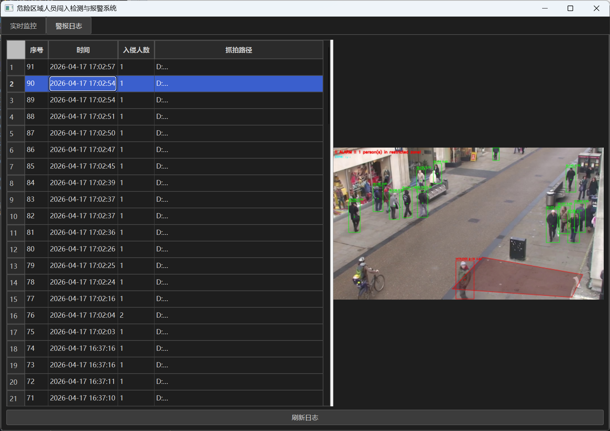

# 危险区域人员闯入检测与报警系统

基于 **YOLOv8 + ByteTrack + i.MX6ULL 边缘计算** 的端云协同安防系统。边缘端（正点原子 Alpha 开发板）负责视频采集与帧差法运动检测，PC 端负责深度学习推理与报警决策，双端通过 TCP 协同工作。

## 效果演示

### 系统运行截图



### 入侵检测效果



### 演示视频
[](assets/demo_video.mp4)

## 系统架构

```
┌─────────────────────────┐         TCP:8888          ┌──────────────────────────────┐
│   i.MX6ULL 边缘端 (C)    │  ── 视频流 (MJPEG) ──▶   │       PC 服务端 (Python)       │
│                         │                          │                              │
│  V4L2 采集              │         TCP:8889          │  SocketStreamProducer (拉流)   │
│  帧差法运动检测           │  ◀── 报警指令 (0x01/00) ── │  InferenceWorker (YOLO推理)    │
│  MJPEG 按需发帧          │                          │  PySide6 GUI (可视化)          │
│  蜂鸣器/LED 报警控制      │                          │  SQLite (报警日志)             │
└─────────────────────────┘                          └──────────────────────────────┘
```

### 线程模型（严格的生产者-消费者架构）

| 线程 | 职责 | 关键约束 |
|------|------|---------|
| UI 主线程 | PySide6 渲染、用户交互、多边形绘制 | **禁止任何阻塞操作** |
| 拉流线程 (生产者) | Socket/摄像头/视频文件 → `DropOldQueue` | 队列满时丢弃旧帧，保证实时性 |
| 推理线程 (消费者) | YOLO+ByteTrack → 多边形入侵判定 → Qt Signal | 通过信号安全更新 UI |
| 报警线程 | 接收 PC 报警指令，控制蜂鸣器/LED | 独立 TCP 服务端，超时自动解除 |

## 功能特性

- **自定义警戒区域**：鼠标左键绘制多边形顶点，右键闭合，坐标归一化持久化
- **YOLOv8 + ByteTrack**：实时人体检测与多目标跟踪，仅检测 person 类别
- **多边形碰撞检测**：`cv2.pointPolygonTest` 判定目标中心点是否在警戒区域内
- **边缘端帧差法**：libjpeg DCT 域 1/4 缩放 + 灰度解码，按需发帧节省 60%+ 带宽
- **双向报警联动**：PC 检测到入侵 → 发送指令 → 开发板蜂鸣器/LED 响应
- **报警日志**：SQLite 持久化 + 抓拍截图 + 可视化历史查询（带回写确认）
- **断线自动重连**：开发板指数退避重连，PC 端断开后无需人工干预
- **多源输入**：支持本地摄像头、视频文件、RTSP 流、Socket（开发板）四种输入源

## 目录结构

```
Human_Detection/
├── README.md                   # 本文件
├── imx6ull_client/             # 边缘端（C 语言）
│   └── v4l2_camera.c           # V4L2 采集 + 帧差法 + TCP 推流 + 报警控制
└── pc_server/                  # PC 服务端（Python）
    ├── main.py                 # 主程序入口（PySide6 GUI + 线程编排）
    ├── video_pipeline.py       # 后端管道（队列/检测器/生产者/消费者/AlarmSender）
    ├── ui_components.py        # 可交互视频控件（多边形绘制）
    ├── alarm_db.py             # SQLite 报警日志模块
    ├── config.json             # 警戒区域配置（归一化坐标）
    ├── yolov8n.pt              # YOLOv8 Nano 预训练模型
    ├── alarm_log.db            # 报警记录数据库
    ├── snapshots/              # 报警抓拍图片
    └── test_video/             # 测试视频
```

## 快速开始

### 环境要求

- **PC 端**：Python 3.8+，支持 Windows / Linux
- **边缘端**：正点原子 i.MX6ULL Alpha 开发板，USB 摄像头（支持 MJPEG），交叉编译工具链

### PC 端安装与运行

```bash
cd pc_server

# 创建虚拟环境并安装依赖
python -m venv .venv
# Windows
.venv\Scripts\activate
# Linux/macOS
source .venv/bin/activate

# 安装依赖
pip install PySide6 opencv-python ultralytics numpy

# 启动主程序
python main.py
```

启动后在 GUI 中选择视频源：
- **Socket 模式**：输入 `socket://0.0.0.0:8888`，等待开发板连接
- **本地摄像头**：选择摄像头序号
- **视频文件**：点击"浏览"选择文件

### 边缘端编译与运行

```bash
cd imx6ull_client

# 交叉编译（需要 arm-linux-gnueabihf 工具链和 libjpeg-dev）
arm-linux-gnueabihf-gcc v4l2_camera.c -o client -lpthread -ljpeg

# 拷贝到开发板后运行
./client /dev/video2 <PC端IP地址>
```

> **libjpeg 依赖**：开发板 rootfs 中需包含 `libjpeg.so`。可通过 `apt install libjpeg-dev:armhf`（Debian/Ubuntu sysroot）或 Buildroot/Yocto 构建获取。

## 通信协议

### 视频流（TCP 端口 8888）

```
开发板 → PC（每帧）：
┌──────────────────┬─────────────────────┐
│ 4 字节小端 uint32 │   N 字节 JPEG 数据    │
│   (帧大小 N)      │                     │
└──────────────────┴─────────────────────┘
```

### 报警指令（TCP 端口 8889）

```
PC → 开发板（单字节指令）：
  0x01  开启报警（蜂鸣器 + LED）
  0x00  关闭报警
```

## 边缘端帧差法运动检测

为降低网络带宽占用，边缘端在发帧前进行轻量级运动检测：

1. **JPEG → 灰度缩略图**：利用 libjpeg DCT 域缩放（`scale_denom=4`），640×480 → 160×120，直接输出灰度（`JCS_GRAYSCALE`）
2. **像素级帧差**：逐像素 `|curr - prev| > 25` 计数，变化像素占比 > 2% 判定为运动
3. **按需发帧**：有运动 → 立即发送；无运动 → 每 2 秒发一帧心跳保活

| 参数 | 默认值 | 说明 |
|------|--------|------|
| `MOTION_WIDTH` | 160 | 检测分辨率宽度 |
| `MOTION_HEIGHT` | 120 | 检测分辨率高度 |
| `MOTION_THRESHOLD` | 25 | 单像素差异阈值 (0~255) |
| `MOTION_RATIO` | 0.02 | 变化像素占比阈值 (2%) |
| `HEARTBEAT_INTERVAL` | 2 | 心跳帧间隔（秒） |

## 容错与健壮性

| 场景 | 处理机制 |
|------|---------|
| PC 端关闭/崩溃 | 开发板 `send()` 检测到断开 → 关闭报警 → 指数退避自动重连 (1s→2s→4s→...→10s) |
| SIGPIPE 信号 | `signal(SIGPIPE, SIG_IGN)` 忽略，通过返回值判断 |
| 报警通道异常断开 | `SO_RCVTIMEO` 5 秒超时 → 连续超时自动关闭蜂鸣器 |
| JPEG 解码失败 | `setjmp/longjmp` 错误恢复，该帧无条件发送 |
| ByteTrack 跟踪丢失 | 自动回退到纯 YOLO 检测模式 |
| 数据库写入失败 | 回调通知主线程，状态栏显示错误信息 |
| TCP 粘包/分包 | `_recv_exactly()` 循环拼接，精确接收指定字节数 |

## 技术栈

| 层级 | 技术 |
|------|------|
| 边缘端 | C / V4L2 / libjpeg / POSIX Thread / Socket |
| PC 端 GUI | PySide6 (Qt6) |
| 目标检测 | YOLOv8n (Ultralytics) |
| 多目标跟踪 | ByteTrack |
| 图像处理 | OpenCV |
| 数据持久化 | SQLite3 |
| 硬件平台 | 正点原子 i.MX6ULL Alpha 开发板 |
